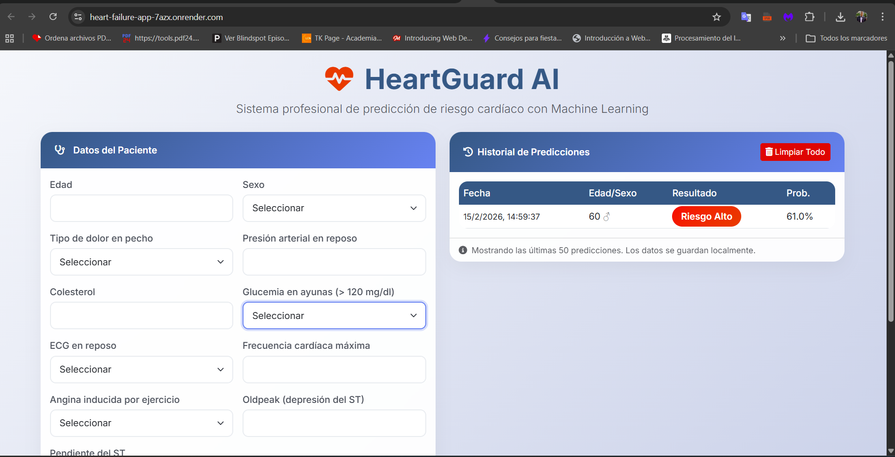
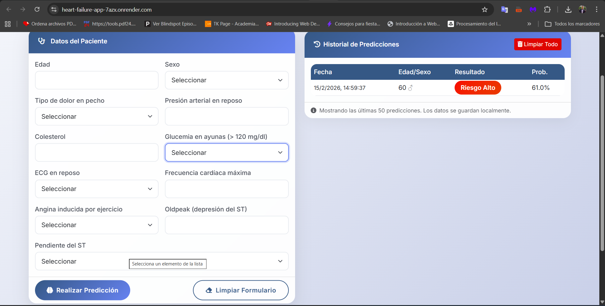
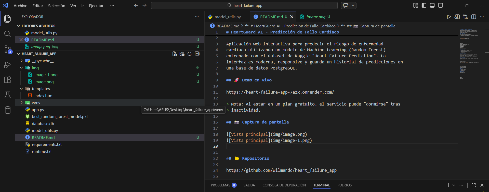

# HeartGuard AI - Predicción de Fallo Cardíaco

Aplicación web interactiva para predecir el riesgo de enfermedad
cardíaca utilizando un modelo de Machine Learning (Random Forest)
entrenado con el dataset de Kaggle "Heart Failure Prediction". La
interfaz es moderna, responsive y guarda un historial de predicciones en
una base de datos PostgreSQL.

## 🚀 Demo en vivo

https://heart-failure-app-7azx.onrender.com/

> Nota: Al estar en un plan gratuito, el servicio puede "dormirse" tras
> inactividad.

## 📸 Captura de pantalla

## 📂 Repositorio

https://github.com/wilmerdd/heart_failure_app

## 📁 Estructura del proyecto

heart_failure_app/ │ 
├── app.py\
├── model_utils.py\
├── best_random_forest_model.pkl\
├── scaler.pkl\
├── requirements.txt\
├── runtime.txt\
├── README.md\
├── database.db\
├── venv/\
└── templates/index.html

## ✨ Características

-   Predicción en tiempo real (\>85% precisión)
-   Interfaz moderna con Bootstrap 5
-   Historial persistente con PostgreSQL
-   Totalmente responsive
-   Código modular

## 🧠 Dataset y Modelo

Dataset: Heart Failure Prediction Dataset (Kaggle -- fedesoriano)

Codificaciones: - Sexo: {'F':0,'M':1} - Dolor:
{'ASY':0,'ATA':1,'NAP':2,'TA':3} - ECG: {'LVH':0,'Normal':1,'ST':2} -
Angina: {'N':0,'Y':1} - Pendiente ST: {'Down':0,'Flat':1,'Up':2}

## 🛠️ Tecnologías

Python, Flask, scikit-learn, PostgreSQL, SQLAlchemy, Bootstrap, Render,
GitHub

## ⚙️ Instalación

git clone https://github.com/wilmerdd/heart_failure_app.git\
cd heart_failure_app\
python -m venv venv\
venv`\Scripts`{=tex}`\activate  `{=tex} pip install -r requirements.txt\
python app.py

Abrir: http://127.0.0.1:5000/

## ☁️ Despliegue

Build: pip install -r requirements.txt\
Start: gunicorn app:app

Configurar DATABASE_URL

## 📊 Uso

1.  Completa formulario
2.  Realiza predicción
3.  Guarda historial

## 👨‍💻 Autor

Wilmer Duque Diaz\
GitHub: wilmerdd

## 📄 Licencia

MIT

## 🙏 Agradecimientos

fedesoriano (Kaggle)\
Render\
Bootstrap\
Font Awesome
